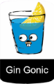

# ⚽️ Soccer Betting - Backend




> ℹ️ This project was created as a study base for the Go language and its main frameworks and libraries. It's an open source project, so feel free to participate with ideas and code by creating issues and submitting pull requests.

- [⚽️ Soccer Betting - Backend](#️-soccer-betting---backend)
  - [Stack](#stack)
  - [Create and configuration project](#create-and-configuration-project)
  - [Setup development](#setup-development)
  - [Structure](#structure)
  - [References](#references)


## Stack
- [Golang](https://go.dev/)
- [Zap Logger](https://github.com/uber-go/zap)
- [Viper Environment Variables](https://github.com/spf13/viper)
- [Gin Web Framework](https://gin-gonic.com/)
- [Database Postgres](https://www.postgresql.org/docs/)
- [ORM Gorm](https://gorm.io/index.html)

## Create and configuration project
- [x] [Setup Golang](https://www.practical-go-lessons.com/chap-4-setup-your-dev-environment)  `mkdir world-cup && cd world-cup && go mod init world-cup`
- [x] [Setup Environment Variables]() `go get github.com/spf13/viper`
- [x] [Setup Web API](https://gin-gonic.com/docs/)  `go get -u github.com/gin-gonic/gin`
- [x] [Setup Logger](https://github.com/uber-go/zap) `go mod init world-cup`
- [x] [Setup Database/GORM](https://gorm.io/docs/index.html)
  - `go get -u gorm.io/gorm`
  - `go get -u gorm.io/driver/postgres`

## Setup development
- Install Go
- Clone project `git clone https://github.com/fabianogoes/world-cup && cd world-cup`
- Download dependency `world-cup`
- Let's Code!

## Structure

```
api/ - handlers, routers
|-dto - request models, response models 
cmd/ - bootstrap application
domain/
|-models - Domain classes(entitites...)
|-usecases - Business rules
configuration/ - Frameworks and lib settings: database, loading environments variables, logging, web server, etc...
```

## References
- [How to Setup Golang GORM RESTful API Project with Postgres](https://codevoweb.com/setup-golang-gorm-restful-api-project-with-postgres)
- [World Cup Qatar 2022](https://www.fifa.com/fifaplus/en/articles/qatar-2022-all-qualified-teams-groups-dates-match-schedule-tickets-more)
- [Database Handling with Golang Gorm (CRUD Handling)](https://dev.to/yanoandri/database-handling-with-golang-gorm-crud-handling-4c66)
- [Qatar horarios fase de grupos](https://www.jogosdacopa.net/#/qatar-horarios-fase-de-grupos)
- [Qatar matches and schedules](https://digitalhub.fifa.com/m/538276bde2718fe6/original/2022fwc_qatar_match_schedule_v34b_11082022_EN_international-use.pdf)
