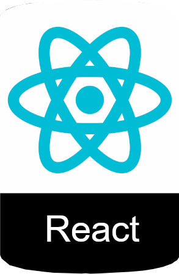
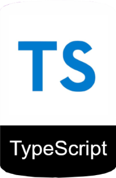

# Soccer Betting - Frontend




- [Soccer Betting - Frontend](#soccer-betting---frontend)
  - [Stack](#stack)
  - [Json Server Mock Backend](#json-server-mock-backend)
    - [Json Server usando `yarn`](#json-server-usando-yarn)
    - [Json Server usando `npm`](#json-server-usando-npm)
  - [Visual Studio Code](#visual-studio-code)
    - [Theme](#theme)
    - [Extensions](#extensions)
  - [Referencias usadas](#referencias-usadas)
  - [Problemas e soluções](#problemas-e-soluções)


## Stack

- [Yarn](https://yarnpkg.com/getting-started)
- [ReactJS](https://reactjs.org/docs/getting-started.html)
- [Vite](https://vitejs.dev/guide/)
- [TypeScript](https://www.typescriptlang.org/docs/)
- [Material UI](https://mui.com/material-ui/getting-started/overview/)
- [Json Server](https://github.com/typicode/json-server)
- [Axios](https://github.com/axios/axios)

## Json Server Mock Backend

Para usar um backend mockado

### Json Server usando `yarn`

```bash
yarn run json-server -w -p 3333 ./mock/database.json
```

### Json Server usando `npm`

```bash
npm run json-server -w -p 3333 ./mock/database.json
```


## Visual Studio Code

Configurações e extenções para o Visual Studio Code

### Theme

- [Aura Theme](https://marketplace.visualstudio.com/items?itemName=DaltonMenezes.aura-theme)
- [Material Icon Theme](https://marketplace.visualstudio.com/items?itemName=PKief.material-icon-theme)

### Extensions

- [Color Highlight](https://marketplace.visualstudio.com/items?itemName=naumovs.color-highlight)
- [DotENV](https://marketplace.visualstudio.com/items?itemName=mikestead.dotenv)
- [EditorConfig for VS Code](https://marketplace.visualstudio.com/items?itemName=EditorConfig.EditorConfig)
- [ESLint](https://marketplace.visualstudio.com/items?itemName=dbaeumer.vscode-eslint)
- [GitLens](https://marketplace.visualstudio.com/items?itemName=eamodio.gitlens) ****
- [Vscode-Styled-Components](https://marketplace.visualstudio.com/items?itemName=styled-components.vscode-styled-components)

## Referencias usadas

- [Curso de React com Material UI 5 e Typescript | Youtube](https://youtube.com/playlist?list=PL29TaWXah3iaqOejItvW--TaFr9NcruyQ)
- [Começando com React em 2022 by Rocketseat | Youtube](https://youtu.be/pDbcC-xSat4)
- [Configurando VSCode para Node.js, ReactJS e React Native | Diego Fernandes | Youtube](https://youtu.be/c7P03kkrEG8)
- [CÓMO configurar ESLINT y PRETTIER en REACT | Youtube](https://youtu.be/3BHXuZvI4FI)

## Problemas e soluções

- [How to fix ReactDOM.render is no longer supported in React 18](https://www.codingdeft.com/posts/react-dom-render-not-supported-react-18/)


